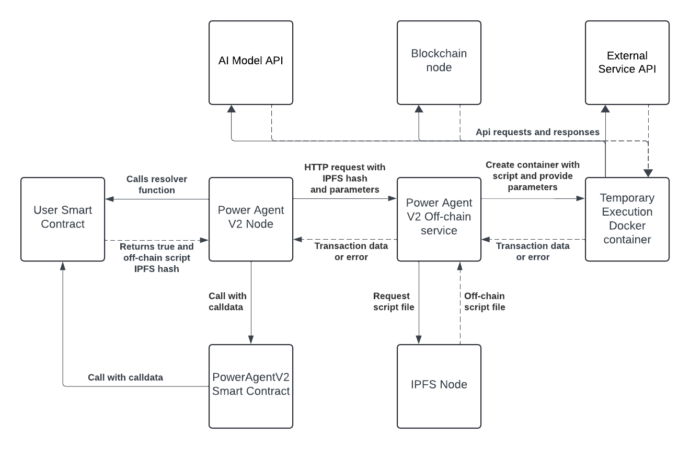

# PowerAgent V2 Off-chain service 

The Power Agent network supports various jobs for automatic execution, including Off-chain resolver jobs (Web3 Functions). These jobs use on-chain and off-chain conditions, plus AI agent decisions. The job owner provides scripts that process this data and generate execution outputs. 

The PowerAgent V2 Off-chain service executes these scripts from IPFS hashes within Docker containers, returning the transaction data. This service uses Node.js with Express for handling HTTP requests, IPFS for script storage, and Docker for isolated execution.



## Run PowerAgent V2 Off-chain service

We recommend running both PowerAgent V2 Node and PowerAgent V2 Off-chain service from the [Docker Compose repository](https://github.com/powerpool-finance/powerpool-agent-v2-compose). However, for developing and testing off-chain resolvers, one can run the Off-chain service from this repository.   

### Run PowerAgent V2 Off-chain service Locally

#### Install Docker Engine

1. [Install Docker](https://docs.docker.com/engine/install)
2. Pull the Docker image: `docker pull node:18-alpine`

#### Install Dependencies and Build

```
yarn & yarn build
```

#### Test
```
npm t
```

#### Run with node on local machine

> **Important:** This will not work on macOS.

1. Specify values in `./config/main.yaml` config file
2. Generate key JSON with the password from `./config/main.yaml`, for example:
```
PRIVATE_KEY=0xbe7180384b3a84262ccf05e4bf7b09fa5ad793e23314ff12f9a78cea7ade971f PASS=PowerPool#TheGreat npm run jsongen
```
3. Run Docker Compose:
```
docker compose up
```
> **Important:** This will build and start the `offchain-service` Docker container locally and `powerpool/power-agent-node:dev` from Docker Hub.

## How off-chain scripts work
An off-chain resolver is a simple script written in JS or TS that must meet these prerequisites:
1. PowerAgentV2 Node passes several parameters to the Off-chain service. These parameters may not always be necessary but can be useful. Therefore, you should process them accordingly.  
```javascript
const params = JSON.parse(process.argv[2]);
const {agent: agentAddress, resolverContractAddress, resolverCalldata, rpcUrl, chainId, from} = params;
```
2. You can use some predefined PowerAgent V2 node API calls, so it will be better if you handle `agentApiHost`. You can check the full list of API endpoints in the [sources](https://github.com/powerpool-finance/powerpool-agent-v2-node/blob/dev/app/Api.ts).
```javascript
const agentApiHost = process.env.AGENT_API_HOST || 'http://localhost:8099';
```
3. PowerAgent V2 Off-chain service reads resulting transaction data from Docker container output. So script should contain `console.log()` call with resulted transaction data. Here is an example from `VRFProofGenerator.ts`: 
```javascript
console.log('[RESULT_TX_DATA]:', coordinatorInterface.encodeFunctionData('fulfillRandomWords', [formattedProof, {
    sender: resolverContractAddress,
    numWords: numbRandomWords,
    blockNum: requestAtBlock,
    subId: subscriptionId,
    callbackGasLimit,
}]));
```
This is quite useful because you can easily test your script by passing the necessary arguments in ENV, generating calldata, and testing this calldata in Tenderly.

4. To build the script, you need to place it in the `./scriptSrc` directory and run `yarn build`. In the command output, you can find IPFS hashes, which should be uploaded to IPFS and stored in your smart contract, and returned by the Resolver function. You can see how it works by checking the [VRFAgentCoordinator](https://github.com/powerpool-finance/powerpool-agent-v2/blob/706d5dde776dff848ba1136916b1124c11810553/contracts/VRFAgentCoordinator.sol#L612) example.
```solidity
function fulfillRandomnessResolver(uint64 _subId) external view returns (bool, bytes memory) {
    return (pendingRequestExists(_subId), bytes(offChainIpfsHash));
}
```
5. If you still have questions, use the predefined scripts in `./scriptSrc` as examples.

## Environment variables
| Name               | Default value | Description                                                                          |
|--------------------|---------------|--------------------------------------------------------------------------------------|
| MAX_EXECUTION_TIME | 30            | Number of seconds to wait until execution stops and the container is killed.         |
| AGENT_API_PORT     | 8099          | Port of agent API service.                                                           |
| COMPOSE_MODE       | 0             | Service flag to run inside Docker Compose (1) or as a single instance (0) for tests. |
